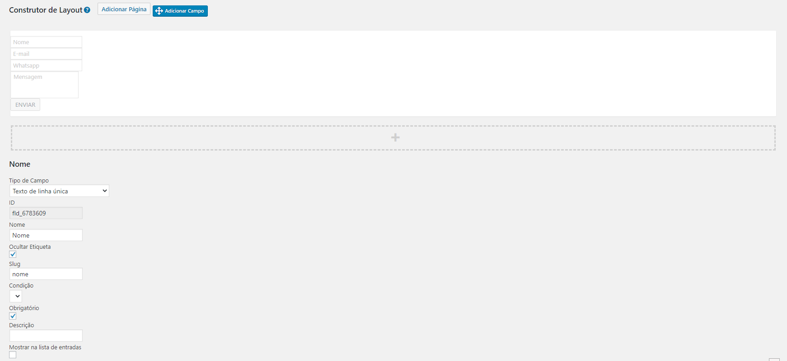

# kaizen-css-wp-plugin
Plugin de wordpress para integração com a ferramenta de gerência de leads
CSS da Kaizen.

Este plugin funciona em conjunto aos plugins [Contact-Form-7](https://br.wordpress.org/plugins/contact-form-7/)
ou [Caldera Forms](https://wordpress.org/plugins/caldera-forms/)


## Como utilizar
Basta instalar e ativar o plugin que a integração já estará funcionando.

Apenas se atentar para os nomes dos campos nos formulários. É **obrigatório**
ter a informação do nome, e-mail e telefone no formulário.

Estes campos devem sempre seguir o seguinte padrão:

* **nome**: Para o nome do lead captado
* **e_mail**: Para o e-mail do lead captado
* **telefone**: Para o telefone do lead captado
* **mensagem**: Para a mensagem escrita pelo lead

## Exemplos

### Contact Form 7
```
<div class="form-informacoes">
    [text* nome placeholder "Nome"]

    [email* e_mail placeholder "E-mail"]

    [text* telefone placeholder "Telefone"]

    [textarea* mensagem 40x5 placeholder "Mensagem"]

    [submit "Enviar"]
</div>
``` 

### Caldera Forms
Para o caldera forms, o slug deve seguir o padrão descrito acima:

